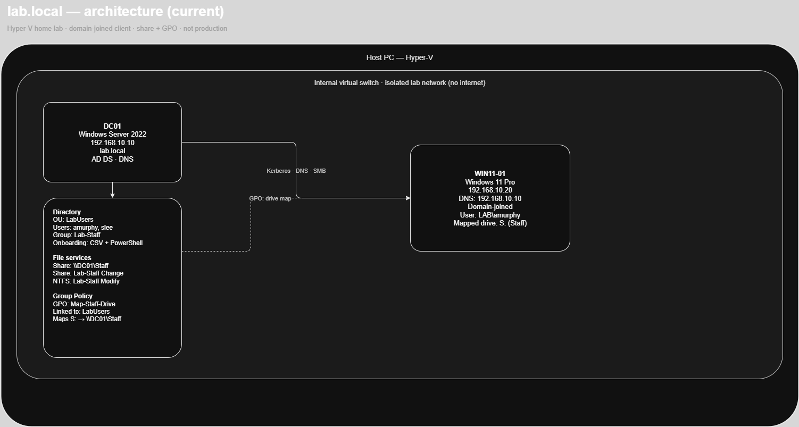
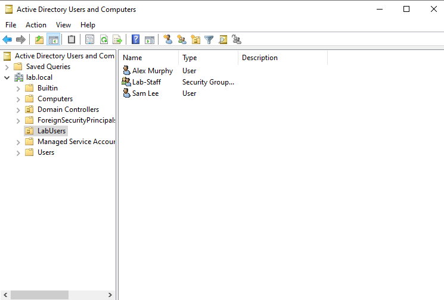
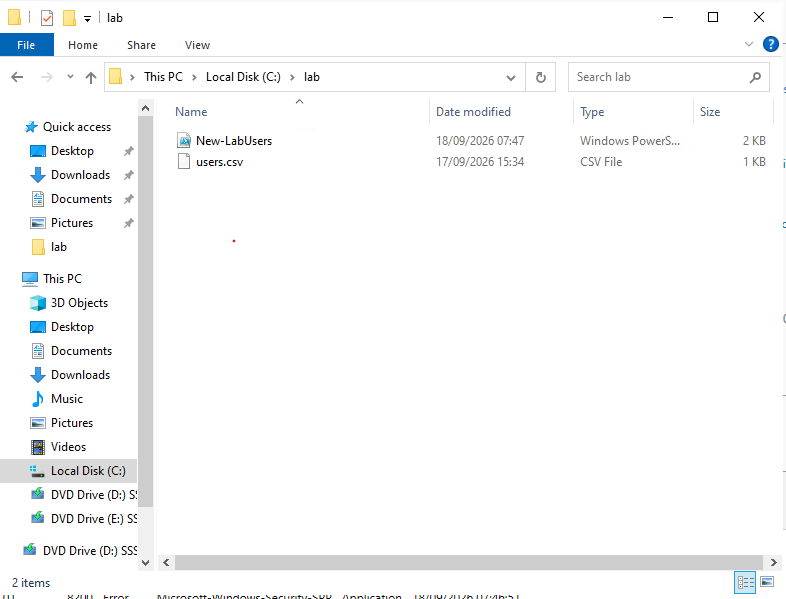
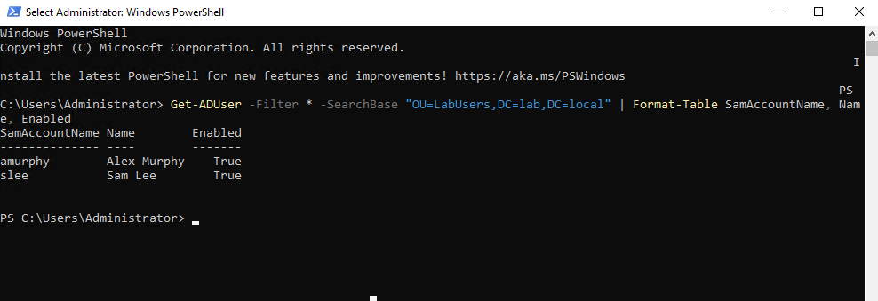
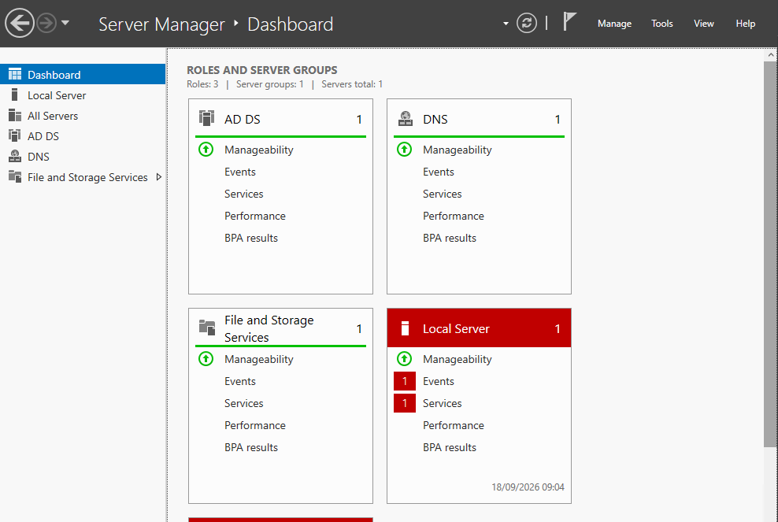
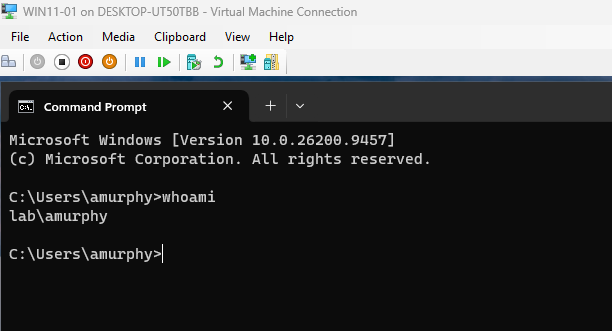
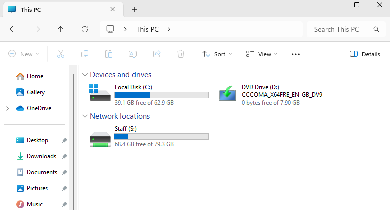
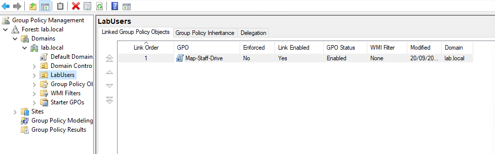

# Active Directory lab (lab.local)

Home lab on Hyper-V. Not a workplace domain. Built to practise first-line work: new users, a PC on the domain, a shared drive, and a Group Policy mapping.

## Architecture

## What is running

- Host: Hyper-V
- Internal virtual switch (isolated lab network, no internet)
- DC01: Windows Server 2022, `192.168.10.10`
- Domain: `lab.local` (AD DS + DNS)
- WIN11-01: Windows 11 Pro, `192.168.10.20`, DNS `192.168.10.10`
- Domain-joined test logon: `LAB\amurphy`

## Identity

- OU: `LabUsers`
- Group: `Lab-Staff`
- Users: `amurphy` (Staff), `slee` (IT)
- Starter data: `users.csv` / `sample-data/fictional-users.csv`
- Script (run on the DC): `scripts/New-LabUsers.ps1`

## File share

- Path on DC: `C:\Staff`
- UNC: `\\DC01\Staff`
- Share: `Lab-Staff` Change; `Administrators` Full Control
- NTFS: `Lab-Staff` Modify

## Group Policy

- GPO: `Map-Staff-Drive`
- Linked to: OU `LabUsers`
- Result: `S:` maps to `\\DC01\Staff` at logon

## What went wrong

- `users.csv` was empty, then saved as `users.csv.txt` because Explorer hid the extension
- First passwords failed domain complexity; the script printed Created while accounts were disabled
- `Administrator` was denied on `\\DC01\Staff` until added on the share — not a member of `Lab-Staff`
- Typing a UNC path in Command Prompt is not the same as `dir` or Explorer
- First ping to the DC failed; the second succeeded once the VM was reachable

## What this is not

- Not production
- Not Microsoft Entra ID
- Not Hyper-V as a job title
- Not written helpdesk runbooks yet
