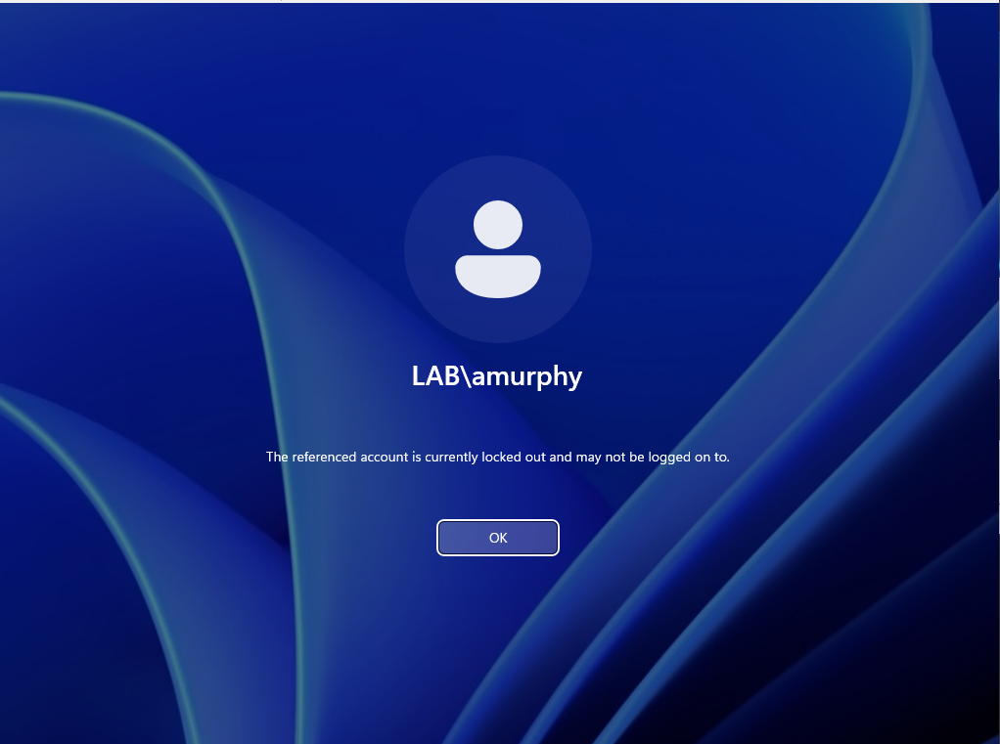
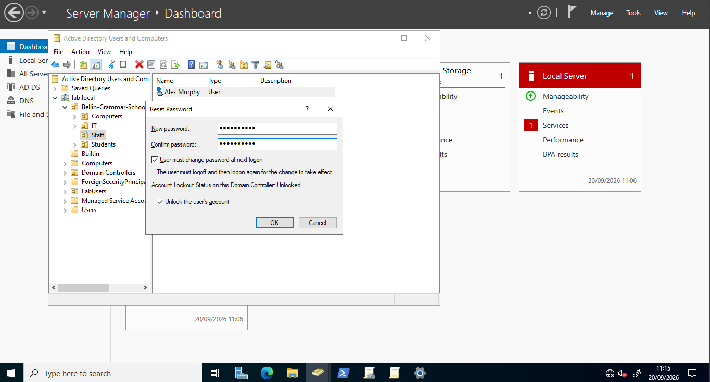
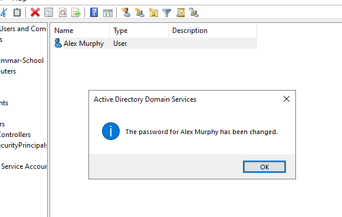
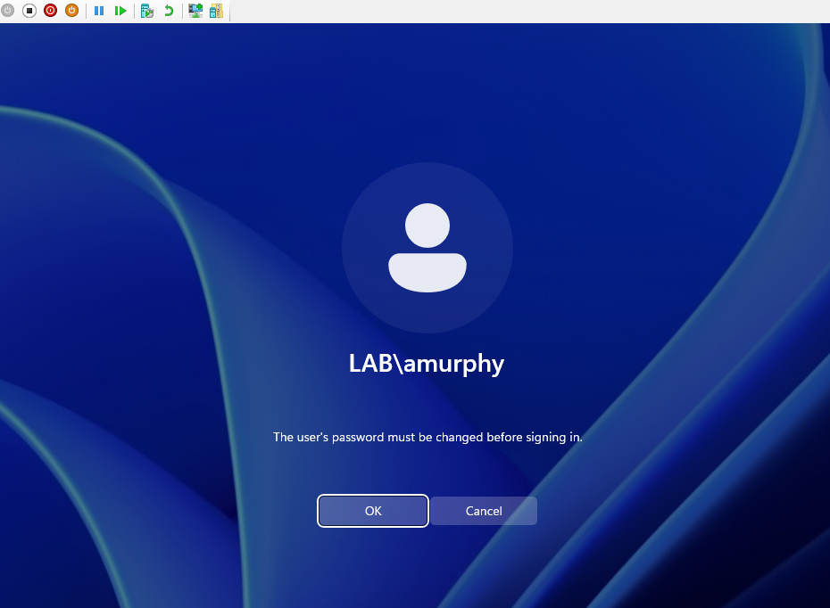

# Account lockout (lab)

Fictional user: `LAB\amurphy` on WIN11-01.

## What the user sees

The referenced account is currently locked out and may not be logged on to.

## What I do

1. Confirm the user in ADUC (Staff OU → Alex Murphy).
2. Right-click → Reset Password.
3. Set a temporary password that meets complexity.
4. Tick Unlock the user's account.
5. Tick User must change password at next logon.
6. OK, then confirm the password was changed.
7. User signs in with the temp password and sets a new one.

## Lab notes

- Lockout threshold is 5 (Default Domain Policy). Fresh AD starts at 0 (never locks).
- Do not unlock or reset `LAB\Administrator` for a normal staff ticket.
